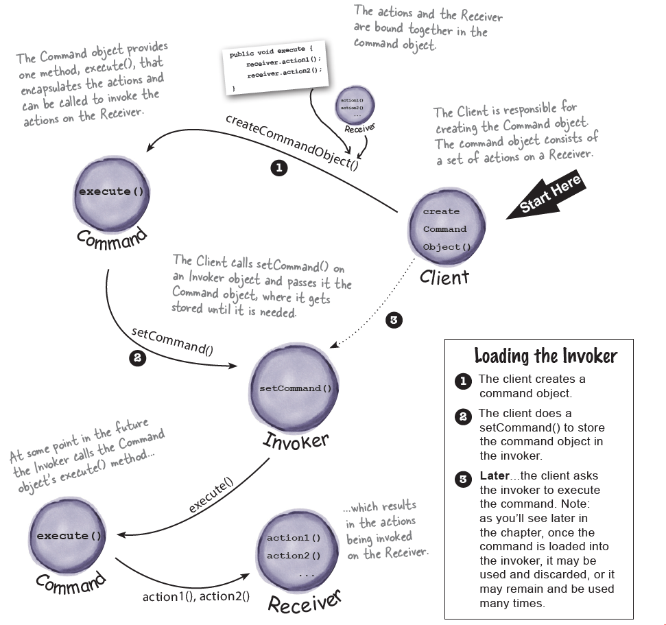

## Encapsulating  Invocation (Command Pattern)

* Command pattern allows to decouple the requester of an action from the object that actually performs the action.
* Here we take an example of a home-automation usecase where we are given the remote(requester) and multiple objects(classes) like TV, fan, refrigerator, etc. These objects are instances of one of vendor classes.
* How to decouple the requester from object? => By introducing command objects in the design. A command object encapsulates a request to do something (like turn on a light) on a specific object (say, the living room light object). So, if we store a command object for each button, when the button is pressed we ask the command object to do some work. The remote doesn’t have any idea what the work is, it just has a command object that knows how to talk to the right object to get the work done. 
* Using this pattern, we could create an API in which these command objects can be loaded into button slots, allowing the remote code to stay very simple.
* To better understand the command pattern and the decoupling; the author detours from the original example of home-automation to an hotel dinner. For an hotel dinner, the order slip is the object that requests for the meal to be prepared. The waiter/waiteress takes the order slips and invokes the orderUp() method on them. And finally, the cook is the main object who has the knowledge of how and what to prepare for on the order slip.
* Think of the Diner as a model for an OO design pattern that allows us to separate an object making a request from the objects that receive and execute those requests. 
* Correlating the above situation with the remote control API, we need to separate the code that gets invoked when a button is pressed from the objects of vendor-specific classes that carry out those requests.
* What if each slot of the remote held an object like the Diner’s Order Slip object? Then, when a button is pressed, we could just call the equivalent of the orderUp() method on this object and have the lights turn on without the remote knowing the details of how to make those things happen or what objects are making them happen.
* Flow of diner example in command pattern - 
    1. Client is responsible for creating the command object which contains a set of actions on receiver.
    2. Command object provides execute method which encapsulates actions and can be called to invoke actions on receiver.
    3. Client calls setCommand function on invoker object and passes command object.
    4. At some point in future, the invoker calls the command object's execute method.
    5. This results in different actions being invoked on the receiver end. 
* Mapping relations between diner example and command pattern -
    * Waitress => Invoker
    * Cook => Receiver
    * orderUp() => execute()
    * Order => Command
    * Customer => Client
* **The Command Pattern encapsulates a request as an object, thereby letting you parameterize other objects with different requests, queue or log requests, and support undoable operations.**
* Overview of classes for Command pattern -
  * Command interface - 
    ```
      public interface Command {
          public void execute(); 
      }
    ```
  * Command class - 
    ```
      public class LightCommand implements Command {
          Light light; //receiver class
          public LightCommand(Light l) {
              light = l;
          }

          public void execute() {
            light.on();
          }
      } 
    ```
  * Command object - 
    ```
      public class SimpleRemoteControl {
          Command Slot;
          public SimpleRemoteControl() {}

          public void setCommand(Command c) {
            slot = c;
          }

          public void buttonPressed() {
            slot.execute();
          }
      }
    ```
  * RemoteControlClass -
    ```
        public class RemoteControlClass {
          public static void main(...) {
            SimpleRemoteControl remote = new SimpleRemoteControl(); //invoker

            Light l = new Light(); //receiver
            LightCommand lc = new LightCommand(l); //create command object and pass receiver to it.

            remote.setCommand(lc); //set the command object light in the remote slot
            remote.buttonPressed(); //simulate the execute method
          }
        }
    ```

* **Class Diagrams** -
  1. Command Pattern Diner example mapping - 
        
  
